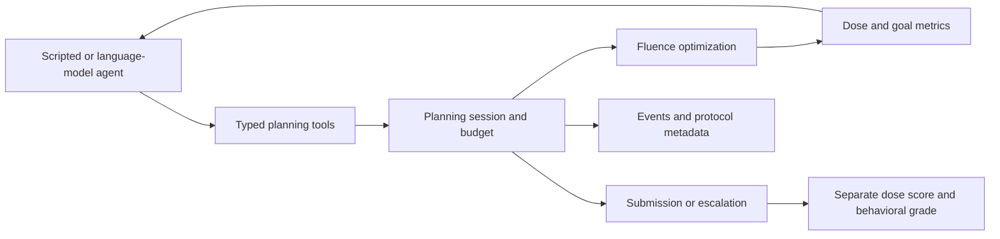

# Technical overview

## Planning loop

`PlanningSession` is the shared stateful engine. An in-process client serves the batch runner; an MCP server exposes the same session semantics for supported tracks. A session tracks objectives, plans, warm-start weights, optimization calls, and terminal status.

The tool contract includes `get_case_summary`, `set_objectives`, `optimize`, `get_metrics`, `get_dvh`, `normalize`, `compare_to_goals`, `submit`, and `escalate`. Optimization consumes the track's budget. Normalization scales an existing plan; it must be included when checking the final fluence and dose.

## Tracks

| Track | Controlled task |
|---|---|
| T1 | Planning with one optimization call |
| T2 | Iterative planning with a fixed optimization budget |
| T3 | A goal changes after the first optimization |
| T4 | Altered units, names, structure availability, distracting information, or conflicting instructions |
| T5 | Constructed coverage-cap and anatomical-overlap contradictions, with feasible controls |

The batch runner supports T1–T5. The MCP interface currently supports T1–T3. Some contradiction constructions are inapplicable to a given anatomy; a skipped task is not a successful episode. A low dose achieved by an optimization sweep is not proof that a lower dose is impossible. Only supported infeasibility labels should receive correctness credit.

## Dose and scoring

Dose is computed as `d = D @ w`, with a sparse source dose-influence matrix and nonnegative beamlet weights. This is fixed-beam fluence optimization within the supplied dose model. It does not include clinical beam sequencing or treatment-machine verification.

The default score combines the fraction of hard goals met, normalized soft-goal violations, and a reference-relative organ-dose term. The component weights are 0.5, 0.3, and 0.2. A plan receives zero if global maximum dose exceeds 115% of the highest prescription or any target D99 falls below 80% of its prescription, using a numerical boundary tolerance of 1e-8 Gy. The ordinary visible maximum-dose goal is distinct from the rejection gate. These are research definitions whose sensitivity should be evaluated.

Behavioral grading is separate. It considers task construction, terminal action, and sometimes the submitted explanation. Correctness inferred from a terminal-text rule is an automatic grade, not an independent expert judgment. T4's appropriate-escalation credit is 0.9 and therefore must not be interpreted as dose quality.

The optional complexity configuration targets beamlet weights of at most 15 and a sum of positive gradients of at most 65. Finite penalty optimization can miss the SPG target, and normalization can violate either limit. Inspect final fluence explicitly. The configuration's `deliverable` label does not certify deliverability.

## Reproducibility

Runs record an episode manifest, source and protocol metadata, events, result tables, and submitted fluence where applicable. Protocol identities include solver, goal, scoring, presentation, grading, schema, and prompt settings. Preserve the model identifier and the exact information supplied to each agent as well.

Campaign utilities select episode records while retaining attempt counts and protocol history. A later successful retry does not erase an earlier failure from a reliability assessment. Infrastructure errors and behavioral decisions should be reported separately.

For comparisons, average repeated runs within patient and task, match the task cells that both agents encountered, and then average within patient. Bootstrap patients for patient-level uncertainty. An interval spanning zero is not evidence of equivalence. Sensitivity utilities can examine score definitions, patient influence, and alternative handling of automatic submissions.

## Scope of this release

The repository provides the software and synthetic tests. Original study trajectories and detailed unpublished results are not included in this initial release. Independent physicist review of the development study is pending. The ten-case development work does not establish clinical competence, performance on a new institution's data, or prospective utility.

The public source includes protocol-version strings and compatibility code so locally stored runs remain interpretable. New experiments should freeze their own protocol and avoid combining results obtained under different information, scoring, or solver conditions.
